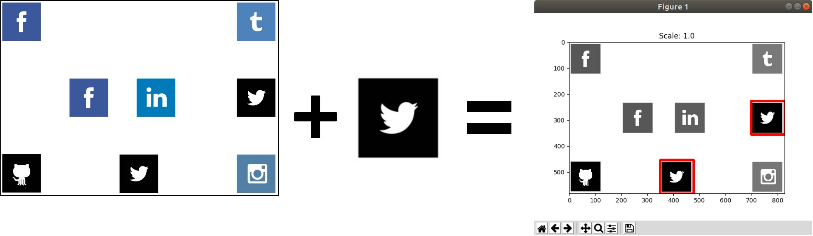
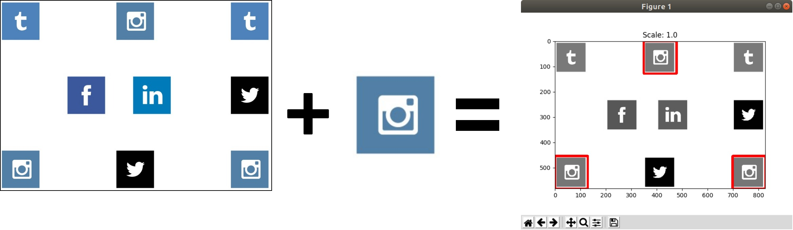

# multiple-object-detection
**Name:** multiple-object-detection  
**Description:** Multiple object detection with scale based on OpenCV Python library  
**GitHub:** https://github.com/korniichuk/multiple-object-detection

## Table of Contents
* **[Introduction](#introduction)**
* **[Theory](#theory)**
  * **[What is template matching](#what-is-template-matching)**
  * **[How does it work](#how-does-it-work)**
* **[Portability](#portability)**
* **[Requirements](#requirements)**
  * **[Ubuntu Desktop](#ubuntu-desktop)**
* **[Python lib versions](#python-lib-versions)**

## Introduction
Multiple detection of **Twitter logo** in example source image:


Multiple detection of **Instagram logo** in example source image:


## Theory
### What is template matching
**Template matching** is a technique for finding areas of an image that match (are similar) to a template image (patch).

### How does it work
We need two primary components:
* source image -- image in which we expect to find a match to the template image;
* template -- patch image which will be compared to the template image.

Goal is to detect the highest matching area. To identify the matching area, we have to compare the template image against the source image by sliding it.

By sliding, we mean moving the patch one pixel at a time (left to right, up to down). At each location, a metric is calculated so it represents how 'good' or 'bad' the match at that location is (or how similar the patch is to that particular area of the source image).

For each location of template over source image, we store the metric in the result matrix. Each location (x, y) in result matrix contains the match metric.

## Portability
`multiple-object-detection` checked on Ubuntu Desktop 18.04 LTS.

## Requirements
### Ubuntu Desktop
Please, install `python3-pil.imagetk` and `python3-tk` packages:
```
$ sudo apt-get update
$ sudo apt-get install python3-pil.imagetk python3-tk
```

Install Python packages:
```
$ sudo pip install -r requirements.txt
```

or
```
$ pipenv install
```

## Python lib versions
* [imutils](https://pypi.org/project/imutils/) ver. 0.5.2
* [numpy](https://pypi.org/project/numpy/) ver. 1.16.3
* [opencv-python](https://pypi.org/project/opencv-python/) ver. 4.1.0.25
* [tkinter](https://tkdocs.com/) ver. 8.6
