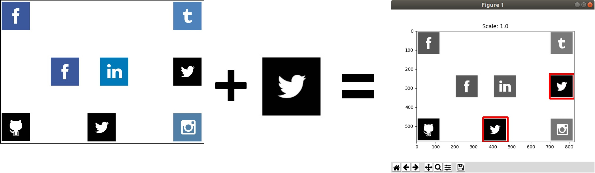
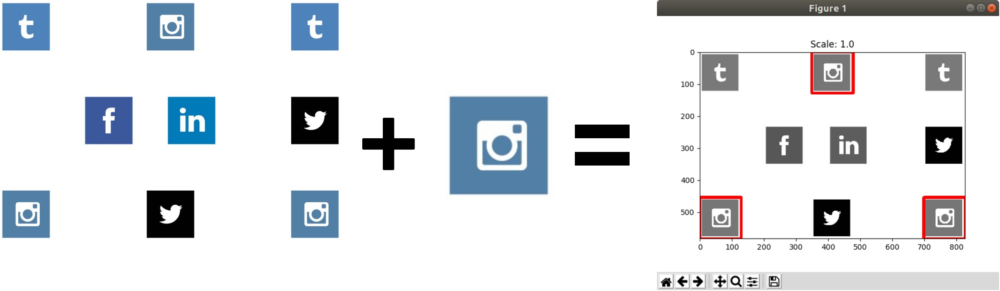

# multiple-object-detection
**Nazwa:** multiple-object-detection  
**Opis:** Wielokrotne wykrywanie obiektu ze skalowaniem oparte na bibliotece Pythona OpenCV  
**GitHub:** [https://github.com/korniichuk/multiple-object-detection](https://github.com/korniichuk/multiple-object-detection)

## Spis treści
* **[Wstęp](#wstęp)**
* **[Teoria](#teoria)**
    * **[Czym jest dopasowywanie wzorców](#czym-jest-dopasowywanie-wzorców)**
    * **[Jak to działa](#jak-to-działa)**
* **[Przenośność oprogramowania](#przenośność-oprogramowania)**
* **[Wymagania](#wymagania)**
    * **[Ubuntu Desktop](#ubuntu-desktop)**
* **[Wersje bibliotek Pythona](#wersje-bibliotek-Pythona)**

# Wstęp
Wielokrotne wykrywanie logotypu **Twitter** na przykładowym obrazie źródłowym:



Wielokrotne wykrywanie logotypu **Instagram** na przykładowym obrazie źródłowym:



# Teoria
## Czym jest dopasowywanie wzorców
**Dopasowywanie wzorców** (ang. template matching) to technika znajdowania obszarów obrazu, które pasują (są podobne) do wzorca.

## Jak to działa
Potrzebujemy dwóch podstawowych elementów:

* obraz źródłowy -- obraz, na którym spodziewamy się znaleźć obszary podobne do wzorca;
* wzorzec -- obraz, który zostanie porównany z obszarem obrazu źródłowego.

Celem jest wykrycie najbardziej pasującego obszaru. Aby zidentyfikować pasujący obszar, musimy porównać wzorzec z obrazem źródłowym, przesuwając go.

Pod przesuwaniem, mamy na myśli przesuwanie o jeden piksel na raz (od lewej do prawej, od dołu do góry). W każdej pozycji obliczana jest metryka, która przedstawia, jak „dobre” czy „źle” jest dopasowywanie w tej pozycji (lub jak podobny jest wzorzec do tego konkretnego obszaru obrazu źródłowego).

Dla każdej pozycji wzorca przechowujemy metrykę w macierzy wyników. Każda pozycja (x, y) w macierzy wyników zawiera metrykę dopasowania.

# Przenośność oprogramowania
`multiple-object-detection` sprawdzony na Ubuntu Desktop 18.04 LTS.

# Wymagania
## Ubuntu Desktop
Zainstaluj paczki `python3-pil.imagetk` oraz `python3-tk`:
```
$ sudo apt-get update
$ sudo apt-get install python3-pil.imagetk python3-tk
```

Zainstaluj biblioteki Pythona:
```
$ sudo pip install -r requirements.txt
```

lub
```
$ pipenv install
```

# Wersje bibliotek Pythona
* [imutils](https://pypi.org/project/imutils/) wersja 0.5.2
* [numpy](https://pypi.org/project/numpy/) wersja 1.16.3
* [opencv-python](https://pypi.org/project/opencv-python/) wersja 4.1.0.25
* [tkinter](https://tkdocs.com/) wersja 8.6
